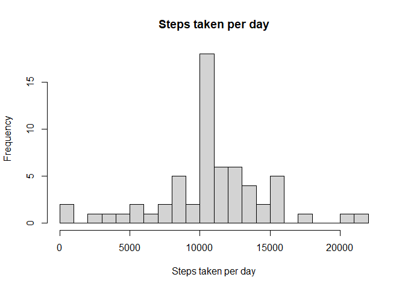

### Loading and preprocessing the data


```r
activityData<-read.csv("activity.csv")
activityData$date<-as.Date(activityData$date)
```
 
### No of steps taken per day


```r
library(ggplot2)
library(dplyr)

stepsTakenPerDay<-activityData %>%
  group_by(date) %>%
  summarise(stepsPerDay=sum(steps,na.rm = T))

hist(stepsTakenPerDay$stepsPerDay,breaks = 20,xlab = "Steps taken per day",main = "Steps taken per day")
```

<!-- -->

## Mean and Median steps taken per day

```r
mean <- mean(stepsTakenPerDay$stepsPerDay)
mean
```

```
## [1] 9354.23
```

```r
median<-median(stepsTakenPerDay$stepsPerDay)
median
```

```
## [1] 10395
```

## Time Series Plot for the 5-minute interval (x-axis) and the average number of steps taken

```r
library(ggplot2)
library(dplyr)

averageStepsPerInterval<-activityData %>%
  group_by(interval) %>%
  summarise(stepsPerDay=mean(steps,na.rm = T))

plot(averageStepsPerInterval$interval,averageStepsPerInterval$stepsPerDay,xlab = "Interval",ylab = "Average Steps",type = "l",main = "Average steps per 5 min interval")
```

<!-- -->

### 5 Minute interval with max steps

```r
averageStepsPerInterval[[which.max(averageStepsPerInterval$stepsPerDay),"interval"]]
```

```
## [1] 835
```

### Total number of missing values

```r
sum(rowSums(is.na(activityData)))
```

```
## [1] 2304
```

### Impute missing values based on mean of 5 minute interval

```r
imputedActivityData<-activityData %>% 
  group_by(interval) %>%
  mutate(steps=ifelse(is.na(steps),mean(steps,na.rm=T),steps))
```

### Histogram of steps taken per each day


```r
stepsPerDay<-imputedActivityData %>%
  group_by(date) %>%
  summarise(stepsPerDay=sum(steps,na.rm = T))

hist(stepsPerDay$stepsPerDay,breaks = 20,xlab = "Steps taken per day",main = "Steps taken per day")
```

<!-- -->

## Mean and Median steps taken per day

```r
mean <- mean(stepsPerDay$stepsPerDay)
mean
```

```
## [1] 10766.19
```

```r
median<-median(stepsPerDay$stepsPerDay)
median
```

```
## [1] 10766.19
```

### Mean esitimates from two data frames original and imputed data frame

```r
mean(activityData$steps,na.rm=TRUE)-mean(imputedActivityData$steps)
```

```
## [1] 0
```
There is no significance difference in the means of two data frames.


### Creating a factor variable to imputed data frame

```r
imputedActivityData$weekFactor<-ifelse(weekdays(as.Date(imputedActivityData$date))=="Sunday" | weekdays(as.Date(imputedActivityData$date))=="Saturday","Weekend","Weekday")

imputedActivityData$weekFactor<-as.factor(imputedActivityData$weekFactor)
```
### Panel plot

```r
newData<-imputedActivityData %>%
  group_by(interval,weekFactor) %>%
  summarise(stepsPerDay=mean(steps,na.rm = T))

ggplot(data=newData,aes(x=interval,y=stepsPerDay))+
  geom_line()+
  labs(x="Interval",
       y="Steps")+
  facet_grid(weekFactor~.)
```

<!-- -->
